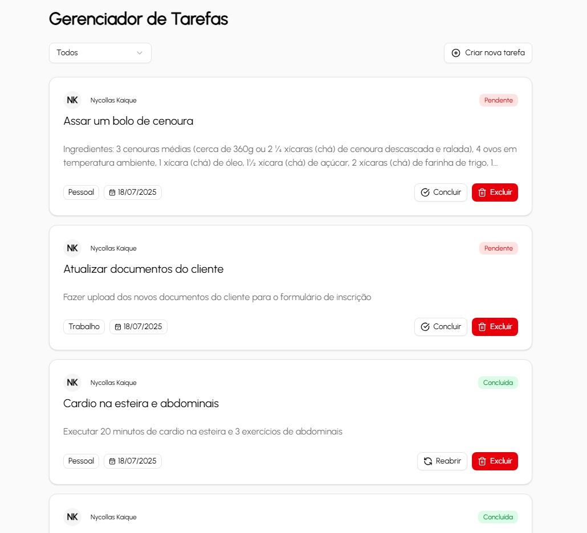
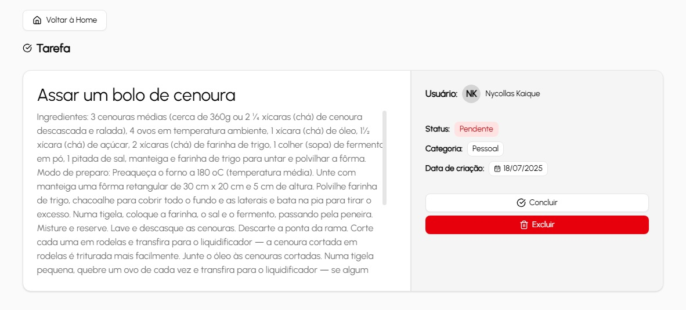

# Dash de Gestão de Tarefas

## Link da aplicação publicada

[Link](https://dash-tarefas-git-main-nyckaiques-projects.vercel.app)

## Projeto




Este projeto é uma aplicação web para listar e gerenciar tarefas, com filtros por categoria e ações para atualizar o status. O projeto conta com basicamente uma página inicial com todas as tarefas e a rota /task/[id] para visualizar uma tarefa específica. O componente TasksList renderiza a lista de tarefas pela mutation getTasks, cada uma em um TaskCard, mostrando as informações da tarefa conforme o type Task:

```
  type Task = {
    id: string;
    title: string;
    description?: string;
    status: "pending" | "completed";
    category: string;
    user: {
      firstName: string;
      lastName: string;
    };
    createdAt: string;
  };
```

Cada TaskCard possui seu ButtonUpdateTaskStatus, que utiliza a mutation updateTaskStatus fazendo um toggle do status entre "pending" e "completed". Além disso, foi implementado adicionalmente um botão ButtonDeleteTask com a mutation deleteTask que remove aquela tarefa da lista. Ao clicar no título da TaskCard, o componente Link do Next te leva para a rota /task/[id], renderizando as informações completas da tarefa recebida pela mutatio getTask. Nessa tela também é possível atualizar o status, remover a tarefa e voltar para a home.

Na home, é possível filtrar as tarefas com o componente CategoryFilter que atualiza o state da categoria e busca novamente as tarefas com a mutation getTasks informando a categoria desejada. Também foi implementado adicionalmente um componente CreatTaskDialog para adicionar novas tarefas a partir da mutation createTask.

Utilizando componentes do shadcn/ui e Tailwind CSS, o projeto todo se encontra estilizado e responsivo para diferentes tamanhos de tela. Foram implementadas também páginas de loading com componentes Skeleton e páginas de erro e not-found.

Com Jest e React Testing Library, foram realizados testes para o componente TaskList ao renderizar e filtrar tarefas por categorias e também para o ButtonUpdateTaskStatus para verificar a atualização do status da tarefa.

O Projeto foi hospedado na Vercel.

## Tecnologias Utilizadas

- **Frontend:** Next.js (App Router) com TypeScript
- **Estilização:** Tailwind CSS
- **Backend:** API GraphQL e Apollo Server integrado ao Next
- **Testes:** Jest e React Testing Library
- **Deploy:** Vercel
- **Outras:** shadcn/ui, Lucide React (ícones)

## Como rodar localmente

Para configurar e executar o projeto em seu ambiente local, siga os passos abaixo:

### 1. Clone o repositório:

```bash
git clone https://github.com/nyckaique/dash-tarefas.git
cd dash-tarefas
```

### 2. Instale as dependências:

```bash
npm install
```

### 3. Configure a variável de ambiente .env.local (e também quando estiver em produção):

```bash
# .env.local
NEXT_PUBLIC_API_URL=http://localhost:3000
```

### 4. Inicie o servidor de desenvolvimento:

```bash
npm run dev
```

A aplicação fica disponível em `http://localhost:3000`.

## Como rodar os testes

Para executar os testes unitários do projeto, utilize o seguinte comando:

```bash
npm test
```
